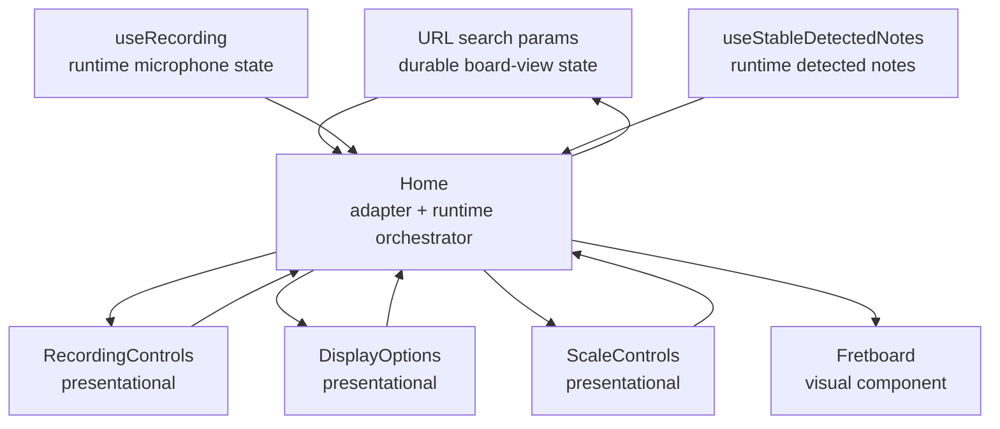

# ADR 0002: URL-backed board view state

Status: Accepted
Date: 2026-09-30

## Context

ADR 0001 chose a controlled-presentational component split for the fretboard refactor:

- `Home` keeps orchestration responsibility.
- Extracted controls stay stateless and presentational.
- Runtime recording and note-detection behavior remains separate from visual controls.

During Stage 1, the page controls were extracted into controlled presentational components:

- `src/components/RecordingControls.tsx`
- `src/components/DisplayOptions.tsx`
- `src/components/ScaleControls.tsx`

This clarified a better state boundary. Some state is not truly runtime-only app state. It describes the current board view and should survive refreshes or be shareable in a URL.

## Decision

Use URL search params for durable board-view configuration.

Selected option: Option A with `replace` navigation.

The URL owns durable, shareable board-view state:

- whether all note labels are shown
- whether the scale overlay is shown
- selected scale root
- selected scale type

Runtime React state still owns ephemeral recording state:

- microphone start/stop lifecycle
- `isRecording`
- `isStarting`
- microphone errors
- live frequency samples
- frequency revisions
- detected notes derived from live frequency

`Home` remains the container/orchestration component, but its role changes from owning all view state to adapting between URL state and presentational controls.

## Search param contract

Use concise, explicit search params:

```text
?labels=1&scale=1&root=A&type=minor-pentatonic
```

Param meanings:

| Param | Values | Default | Meaning |
|---|---|---|---|
| `labels` | `1`, `0` | `1` | show all note labels |
| `scale` | `1`, `0` | `0` | show scale overlay |
| `root` | one of `SHARP_NOTE_NAMES` | `C` | scale root |
| `type` | one of `SCALE_TYPES[*].id` | `DEFAULT_SCALE_TYPE_ID` | scale type |

Invalid or missing params must resolve to defaults. The app should not crash or preserve invalid values from the URL.

## Navigation behavior

Use `router.replace`, not `router.push`, when controls change search params.

Rationale:

- Control changes are view configuration updates, not document navigation.
- The browser back button should not step through every checkbox/select change.
- The current page should be updated in place while preserving shareable URLs.

## Architectural pattern

The architecture becomes:

```text
URL search params = durable board-view state
Home = URL-state adapter + runtime orchestrator
Controls = controlled presentational components
Fretboard = visual component fed by derived props
```

Data flow:



## Implementation guidance

Prefer a small local URL-state adapter over spreading search-param parsing throughout `Home`.

Expected shape:

```ts
type BoardViewParams = {
  showNoteLabels: boolean
  showScale: boolean
  scaleRoot: NoteName
  scaleTypeId: ScaleTypeId
}
```

The adapter should provide current validated values and setters:

```ts
const {
  showNoteLabels,
  showScale,
  scaleRoot,
  scaleTypeId,
  setShowNoteLabels,
  setShowScale,
  setScaleRoot,
  setScaleTypeId,
} = useBoardViewSearchParams()
```

The exact hook/file name may change, but the responsibilities should remain:

- read current `useSearchParams()` values
- validate against known note names and scale type ids
- apply defaults for missing/invalid params
- update only the changed param while preserving unrelated query params
- use `router.replace` for updates

## Relationship to ADR 0001

This ADR narrows ADR 0001's state ownership decision.

ADR 0001 said `Home` owns state. The updated decision is:

- `Home` owns runtime recording orchestration.
- URL search params own durable board-view configuration.
- `Home` adapts URL state into controlled presentational component props.

The Stage 1 component extraction remains valid. The components stay stateless and controlled; only the source of their values changes.

## Updated refactor sequence

Proceed in this order:

1. Finish/review Stage 1: extract presentational controls from `Home`.
2. Stage 2: move durable board-view configuration to search params.
3. Stage 3: introduce named fretboard cell visual state.
4. Stage 4: add focused visual-state tests only if the extracted pure function is worth locking down.
5. Stage 5: consider splitting `FretboardCell` or `FretboardNote` only after visual-state logic is clear.

Reason for moving URL state before fretboard visual-state work:

- It changes the data source for `showNoteLabels`, `showScale`, `scaleRoot`, and `scaleTypeId`.
- Doing it before visual-state refactoring keeps later fretboard work focused on rendering semantics.
- Presentational controls from Stage 1 already make this change smaller: their props do not need to change.

## Non-goals

- Do not URL-store microphone or recording lifecycle state.
- Do not URL-store live detected notes or frequency samples.
- Do not introduce global state management.
- Do not add flats/enharmonic spellings.
- Do not change pitch detection behavior.
- Do not restore detection status UI.

## Reference invariants

- Refreshing a URL with valid params should restore the same board-view configuration.
- Invalid params should fall back to defaults.
- Changing controls should update the URL with `replace`, not `push`.
- Presentational controls should remain stateless.
- Fretboard visual behavior should remain unchanged by the state-source migration.
